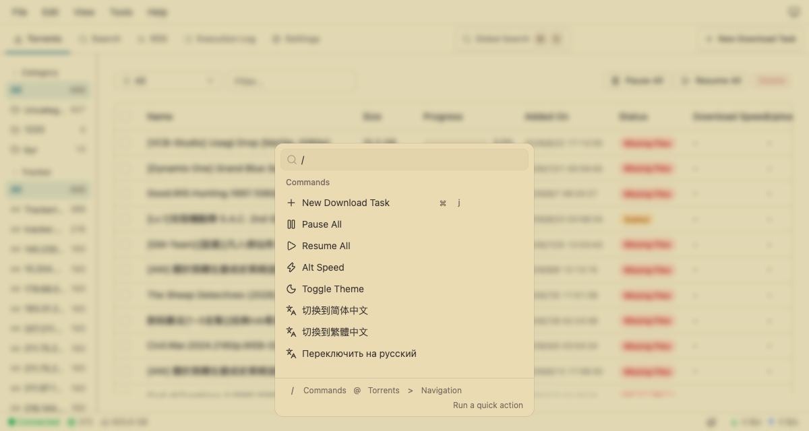
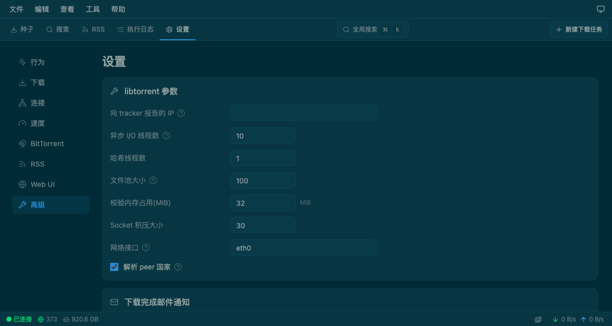
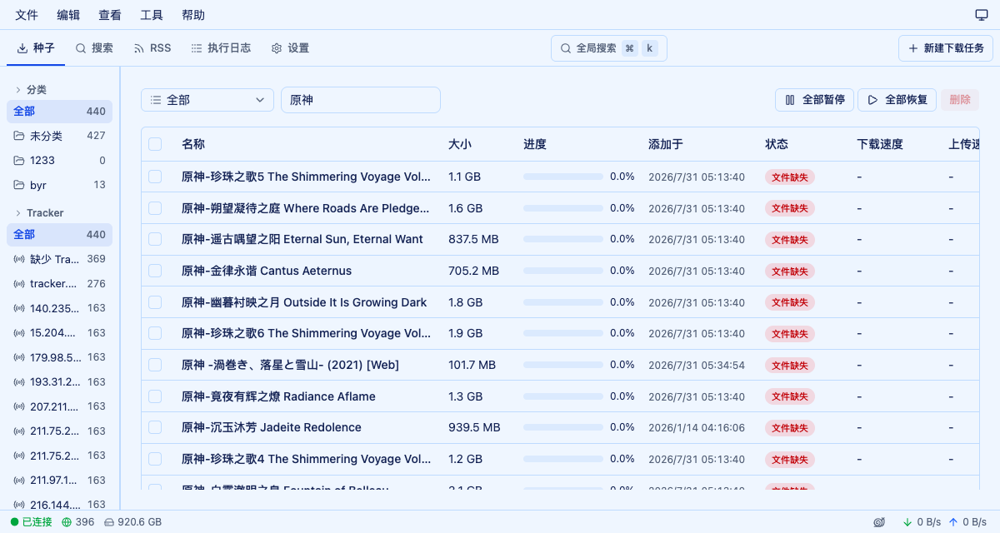

# qiubi

A web UI for qBittorrent, built with React + TypeScript.

It talks to your existing qBittorrent over the Web API — no separate backend needed.

> 🎮 [Online demo](https://kxxoling.github.io/qiubi/) — data is simulated in the browser, no server required.

## Screenshots

<details open>
<summary>Screenshots (click to toggle)</summary>

**Gruvbox Light theme** — command palette (⌘K)



**Solarized Dark theme** — settings



**Blue Light theme** — torrent list



</details>

## Features (in progress)

- Torrent management: list, filters, detail panel, categories, tags
- RSS feeds and auto-download rules
- Search, execution log, most Web UI settings
- Command palette (⌘K), keyboard shortcuts, light/dark/color themes, multiple languages

This project is under active development — features are still being completed and polished.

## Install

### As the qBittorrent Web UI

1. Download `qiubi-vX.Y.Z.zip` from [Releases](https://github.com/kxxoling/qiubi/releases) and extract it
2. qBittorrent → Tools → Options → Web UI → enable **"Use alternative Web UI"** and point it at the extracted folder
3. Restart qBittorrent

### Docker

```bash
docker run -d \
  --name qiubi \
  -p 8080:8080 -p 6881:6881 -p 6881:6881/udp \
  -v qiubi-config:/config \
  -e TZ=Asia/Shanghai \
  ghcr.io/kxxoling/qiubi:latest
```

See [docker/docker-compose.yml](docker/docker-compose.yml) and [docs/TROUBLESHOOTING.md](docs/TROUBLESHOOTING.md) for notes.

### Browser extension

Grab `qiubi-extension-vX.Y.Z.zip` from [Releases](https://github.com/kxxoling/qiubi/releases), unzip, then load it at `chrome://extensions` (Developer mode → Load unpacked). Click the toolbar icon to open the UI and enter your qBittorrent address.

## License

MIT. The temporary project icon is the [qBittorrent](https://github.com/qbittorrent/qBittorrent) logo (GPL).

Development notes: [CONTRIBUTING.md](CONTRIBUTING.md).
